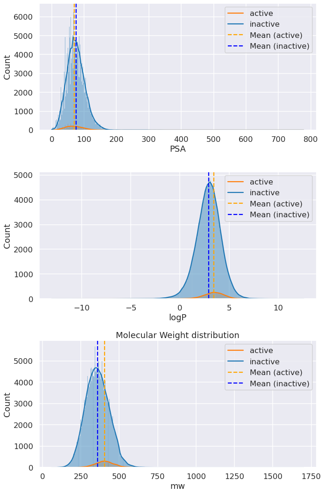
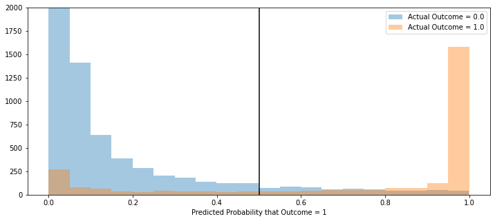

# Capstone: Predicting Drug Cardiotoxicity  
### Kehinde Ajayi, Ph.D.  

## __Contents__:
- [Problem Statement](#Problem-Statement)
- [Introduction](#Introduction)
- [Methods and Tools](#Methods-and-Tools)
- [EDA and Observations](#EDA-and-Observations)
- [Models and Results](#Models-and-Results)
- [Next Steps](#Next-Steps)
- [Conclusions](#Conclusions)
- [References](#References)

### __Problem Statement__
A pharmaceutical company (currently in stealth mode) wants to reduce the costs of new drugs by at least 25% over the next 3 years. To that end, I want to predict the cardiotoxicity of candidate compounds in advance of synthesizing them, thereby avoiding wasting resources on unproductive development.

### __Introduction__
For patients, new medicines offer fewer side effects, fewer hospitalizations, improved quality of life, increased productivity, and importantly, extended lives. Developing medicines is a long, complex process. On average, it takes ___at least ten years___ for a new medicine to complete the journey from initial discovery to the marketplace, with clinical trials alone taking six to seven years on average. The average cost to research and develop each successful drug is estimated to be __$2.6 billion__.<a id='fnref1'>[1](#ref1)</a> This number incorporates the cost of failures – of the thousands and sometimes millions of compounds that may be screened and assessed early in the R&D process, only a few of which will ultimately receive approval. _The overall probability of clinical success (the likelihood that a drug entering clinical testing will eventually be approved) is estimated to be less than 12%_. 

One of the reasons drugs fail in the clinic is because they exhibit unwanted and often serious side effects.  For example, the unintended and often promiscous inhibition of the cardiac human Ether-à-go-go related gene (hERG) potassium channel is a common cause for either delay or removal of therapeutic compounds from development and withdrawal of marketed drugs.<a id='fnref2'>[2](#ref2)</a> The clinical manifestion is prolongation of the duration between QRS complex and T-wave measured by surface electrocardiogram (ECG)—hence Long QT Syndrome. Machine learning techniques may be useful for predicting the level of hERG activity of a compound before money is spent on its development into a drug.

### __Dataset information__

 The hERGCentral (www.hergcentral.org) is mainly based on experimental data obtained from a primary screen by patch clamp electrophysiology against more than 300,000 structurally diverse compounds. The system is aimed to display and combine three resources: primary electrophysiological data, literature, as well as online reports and chemical library collections. <a id='fnref3'>[3](#ref3)</a>,<a id='fnref4'>[4](#ref4)</a>

### __Methods and Tools__

- [Pandas](https://pandas.pydata.org/pandas-docs/stable/index.html)
- [Tensorflow]()
- [Rdkit](https://www.rdkit.org/docs/index.html) – for handling chemical structures and information
- [DeepChem](https://deepchem.readthedocs.io/en/latest/index.html) – for implementing ML models on chemical datasets 
- [Google Cloud Compute](https://cloud.google.com/compute) – for much-needed resources

RDKit was used to calculate 13 structural features:  molecular weight, logP, polar surface area, no. of H-bond acceptors, # of H-bond donors, # of heteroatoms, # of aromatic rings, total # of rings, # of rotatable bonds, # of stereocenters, formal charge, length of SMILES string, and # of Rule-of-5 violations.

### __EDA and Observations__

The averages for 10 of the 13 calculated structural features are as follows:

|                     |       active |     inactive |
|:--------------------|-------------:|-------------:|
| H_bond_acceptors    |  **5.11452**     |  4.87893     |
| H_bond_donors       |  0.940192    |  **1.18231**     |
| SMILES_length       | **47.8869**      | 43.1258      |
| aromatic_rings      |  2.53092     |  2.25245     |
| formal_charge       | -0.000436554 |  0.000289983 |
| num_heteroatoms     |  7.09015     |  6.94303     |
| num_rotatable_bonds |  **6.01608**     |  4.92701     |
| num_stereocenters   |  0.392026    |  0.396021    |
| ro5_violations      |  0.107974    |  0.0770501   |
| total_num_rings     |  **3.5072**      |  2.98087     |

From the above, it seems that hERG inhibitors, on average, have a greater number of H-bond acceptors and fewer H-bond donors, suggesting that the binding site of hERG may have H-bond-donating residues (e.g., serine, threonine, proline).  However, the differences are quite small, so it important to avoid over-interpreting that result.  The data also suggests that hERG inhibitors tend to have more rings and tend to be more flexible (see # of rotatable bonds), though both attributes could be byproducts of a higher average molecular weight (see below). 

Conventional wisdom states that hERG inhibitors tend to 1) have higher molecular weights, 2) be more hydrophobic, and 3) contain basic nitrogen groups.  Exploratory data analysis seems to corroborate those ideas:

  

Compare with the active/inactive distribution of the full dataset:  

Distributons of PSA, cLogP, and molecular weight:  
>

However, a common issue with compound libraries is that molecular weight is often correlated with PSA and/or cLogP. Such collinearity is, to a large degree, an unintended consequence of the synthetic methods that are commonly employed for making larger compounds (e.g., aromatic groups are readily available and relatively easy to append to small molecules). Thus, it is not always clear that high-molecular weight _per se_ is a liability with respect to cardiotoxicity.  This is one of the reasons why metrics that incorporate _ligand efficiency_ are popular among medicial chemists.

The present library exhibits some correlations between MW and cLogP and PSA, though they are not quite as pronounced as in many other libraries:

### __Models and Results__

Embeddings from SMILES strings (TBD), fingerprints, and graph convolutions are herein compared.  The fingerprint embeddings were added to a single layer, 4096-neuron perceptron, whereas the graph convolutions were added to a single layer of 256 neurons. 

An initial model using the calculated features and their interactions terms (105 features in all) gave a model that was no better than baseline, with a Matthews Correlation Coefficient (MCC) of 0. 

The results showed that geometric information was needed to obtain a model that performed any better than baseline.  The embeddings form graph convolutions performed slightly better than those from extended-connectivity fingerprints, as determined by the MCC, but the model still needs a lot of work.  

|          Features          	| Validation MCC 	| Validation accuracy 	|
|--------------------	|----------------	|---------------------	|
| No Structure - calculated variables only       	| 0.0            	| 0.955               	|
| ECFP fingerprints<a id='fnref5'>[5](#ref5)</a>  	| 0.456          	| 0.962               	|
| Graph convolutions<a id='fnref6'>[6](#ref6)</a>	| 0.516          	| 0.959               	|

Performance of the best model from the graph convolution embeddings:  

### __Next Steps__

- Run tokenized SMILES strings through MLP
- Combine embeddings from SMILES, fingerprints, and graph convolutions in transfer learning models
- Cluster compounds and evaluate performance on each cluster
- Use an explanation technique (e.g., LIME, SHAP, Grad-CAM) to update the conventional wisdom
- Explore 3-D representations
- Incorporate into a generative model

### __Conclusions__ 
- Drug discovery is a massive multi-parameter optimization problem that lends itself to various machine learning techniques
- The representation of chemical compounds can greatly affect the performance of machine learning models - graphs are particularly attractive solutions
- The quality and quantity of (publicly available) data are still major sources of contention – GIGO is particularly applicable to drug discovery
- In silico drug discovery is very resource-intensive

### __References__

<a id="ref1">1</a>. "Biopharmaceutical Research & Development: The Process Behind New Medicines" (http://phrma-docs.phrma.org/sites/default/files/pdf/rd_brochure_022307.pdf)<a href=#fnref1>↩︎</a>

<a id="ref2">2</a>. "Human Ether-a-go-go-Related Gene (hERG) Blockers" (https://www.cambridgemedchemconsulting.com/resources/herg_activity.html)<a href=#fnref2>↩︎</a>

<a id="ref3">3</a>. "Investigation of miscellaneous hERG inhibition in large diverse compound collection using automated patch-clamp assay" (https://www.nature.com/articles/aps2015143)<a href=#fnref3>↩︎</a>

<a id="ref4">4</a>. "hERGCentral: a large database to store, retrieve, and analyze compound-human Ether-à-go-go related gene channel interactions to facilitate cardiotoxicity assessment in drug development" (https://pubmed.ncbi.nlm.nih.gov/22149888/)<a href=#fnref4>↩︎</a>

<a id="ref5">5</a>. "Extended-Connectivity Fingerprints" (https://pubs.acs.org/doi/10.1021/ci100050t)<a href=#fnref5>↩︎</a>

<a id="ref6">6</a>. "Convolutional Networks on Graphs for Learning Molecular Fingerprints" (https://arxiv.org/abs/1509.09292)<a href=#fnref6>↩︎</a>

